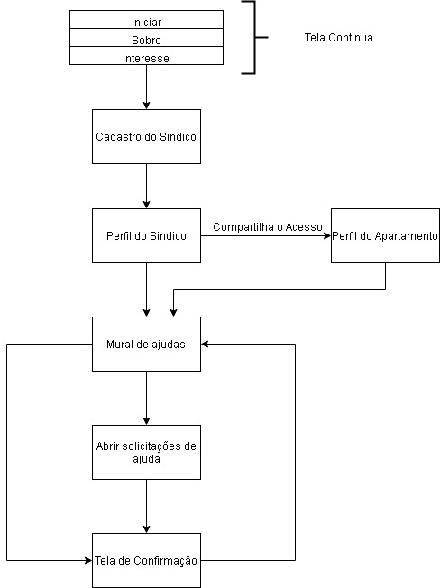

# Condomínio Solidário

---

---

## 📝 Table of Contents

- [About](#about)
- [Tools](#built_using)
- [System Flow](#systemflow)
- [Contributors.](#contri)

## 🧐 About 

Site created to help and assist the condominium manager. Thus, a platform to open and accept help from other apartments at the time of COVID-19. 😷🤮

## ⛏️ Tools 

- [HTML](https://html5up.net/) 
- [CSS](https://pt.wikipedia.org/wiki/Cascading_Style_Sheets) 
- [BootStrap](https://getbootstrap.com/) 
- [Javascript](https://www.javascript.com/)
- [Angular](https://angular.io/)
- [NodeJS](https://nodejs.org/en/)
- [SQL](https://www.mysql.com/)

# System Flow 

---

## 👥 Contributors. 
| Contributors | GitHub |
| ------ | ------ |
| Ana Komase | [Profile](https://github.com/anakomase) |
| Felipe Affonso | [Profile](https://github.com/fe0093)|
| Gabriel Callegari | [Profile](https://github.com/Callegaz)|
| Giovanna Ragozzino | [Profile](https://github.com/giovanaragozzino) |
| Isadora Riegert | [Profile](https://github.com/isadorariegert) |
| Victor Mendes | [Profile](https://github.com/Viictorreiss) |